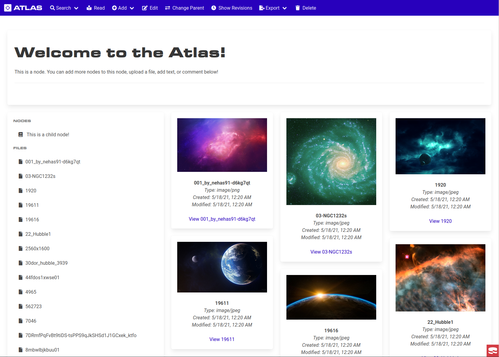

# Atlas: Collaboration System

The Atlas system is designed to facilitate ease of asynchronous collaboration on project design by organizing large documents into small leafs of information with attachments. Discussion can then take place with much finer detail than ever before. It is meant to be light-weight and easy to read for all platforms. It also acts as a frontend for Pandoc, allowing documents to be created and exported on the fly. 

## Features

Atlas leaves most of the work to CakePHP, and uses Bulma to craft an easy to use interface around that. Combined with Pandoc and EasyMDE, Atlas provides powerful document processing capabilities. Atlas tries to follow the rule that "everything is markdown", with comments and nodes having a full Markdown-based editor for formatting text. 

### Nodes

 - Ability to Created, Edit, and Delete nodes. 
 - Nodes are fully markdown capable, provided it is supported by Pandoc. 
 - Can have child and parent nodes, allowing intricate tree structures. 
    + Nodes can be moved anywhere in this tree (except as a child of itself). 
    + Node children can be sorted based on an order field.
 - Can have files attached to them
    + Files will automatically show icons and type descriptions in the view tab. 
    + Certain types of files can be viewed (images) or played (videos)
 - Can have comments attached to them
 - Can be exported to PDF
    + PDFs are fully titled with table of contents, page numbers, and images. 
 - Can be exported to zip
    + Creates a directory structure that can then be imported back into atlas!!
 - The "Read" capability allows previewing the entire structure of a node.
    + Acts like a preview for exported documents. 
    + All files go into full view mode. 

### Revisions
 - All nodes generate revisions when edited.
 - Revisions are signed by user, with date and time stamps. 
 - Revisions can be traced back and forth in a list like a timeline. 

### Files
 - Can upload any file.
 - Formats are detected automatically, and given special capabilties.
 - Audio and Video both play.
 - Images generate thumbnails and display inline.
 - CSV files become tables automatically. 

### Comments
 - Full comment threads are supported.
 - Comments have full markdown support.
 - Created, Edit, Delete.

### Users
 - Can create multiple users. 
 - Can assign a time zone, and see indicator of what time each person is at during the day. 
## Local Environment Setup

1. `. shell-env.sh`
2. `at-npm install`
3. `docker-compose up -d --build`
4. `at-composer install`
5. `at-cake migrations migrate` and `at-cake migrations seed`
6. Navigate to `http://localhost:4000`
7. Login with `root@example.com` using password `root`

## Dependencies
### CakePHP 3.x

[PHP MVC Framework](https://cakephp.org/)

The framework source can be found here: [cakephp/cakephp](https://github.com/cakephp/cakephp).

### Bulma

Modern CSS framework.

[https://bulma.io/](https://bulma.io/)

### Pandoc

Universal document converter. 

[https://pandoc.org/](https://pandoc.org/)

### EasyMDE

Simple HTML Markdown editor. 

[https://github.com/Ionaru/easy-markdown-editor](https://github.com/Ionaru/easy-markdown-editor)
